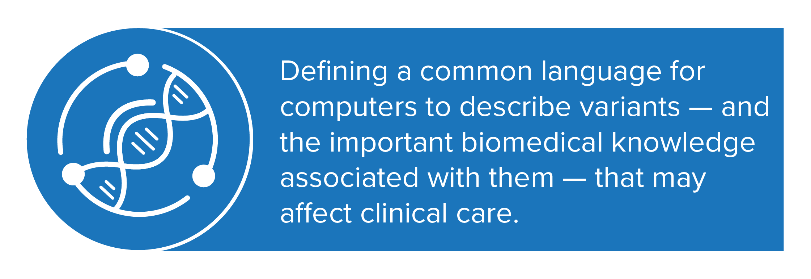
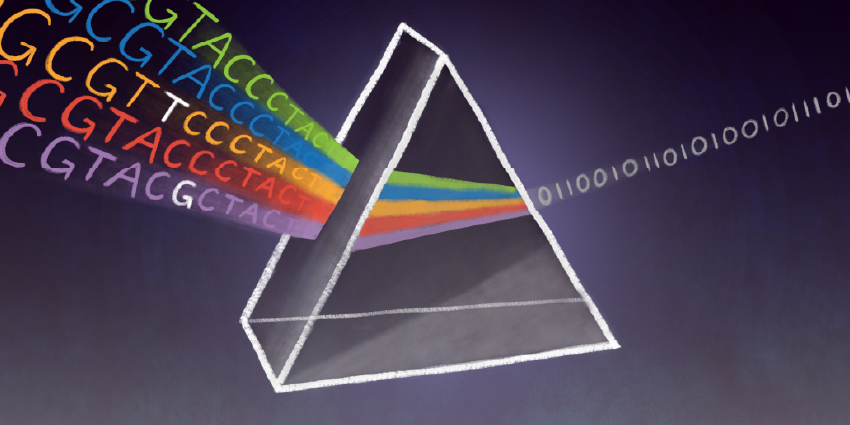
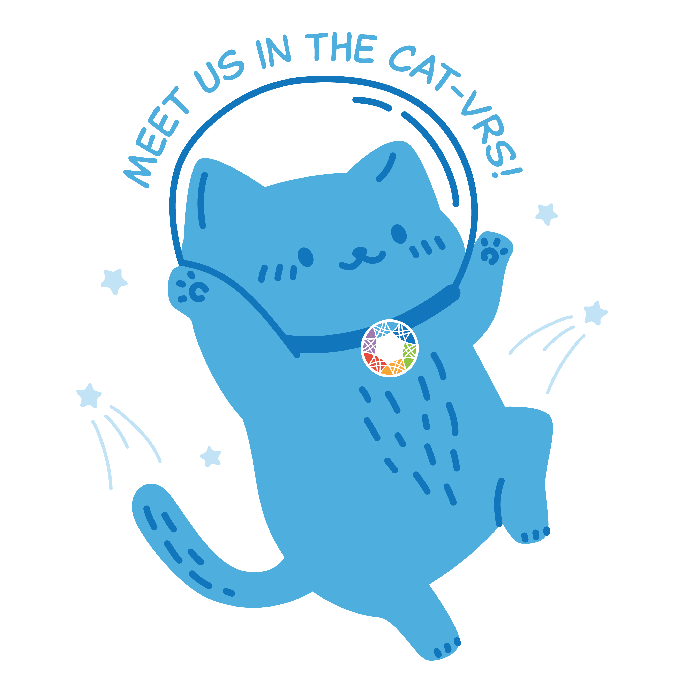
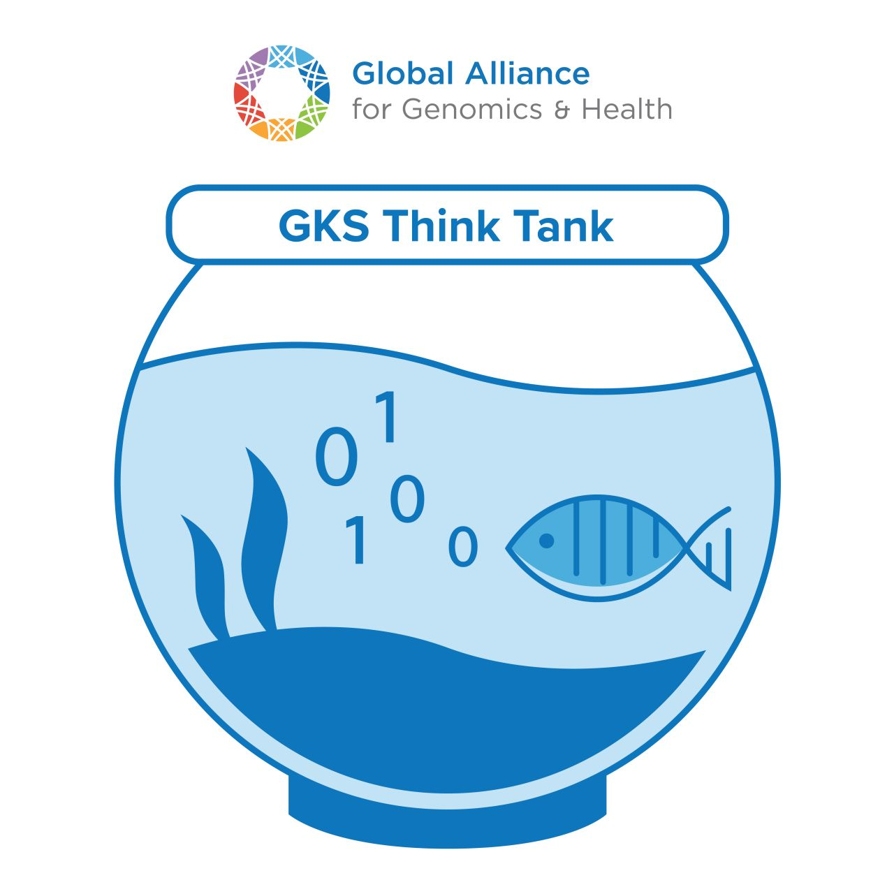

# GA4GH Genomic Knowledge Standards (GKS)

### We're building the language of genomic knowledge.

A common framework to represent, share, and interpret genomic data across borders, platforms, and disciplines. From genetic variants to clinical interpretations, our standards unlock the full power of precision medicine by ensuring data is not just accessible, but usable.

Genomic science is accelerating — but fragmented data holds us back. GKS creates interoperable, open standards that connect labs, clinics, and researchers worldwide, enabling seamless exchange and trusted interpretation of genomic findings.

### GKS Products and Study Groups

|  |  |
|---|---|
|  | **Variation Representation Specification (VRS)** VRS provides semantically precise representations of variation and leverages this design to enable federated identification of biomolecular variation with globally consistent and unique computed identifiers.  • [Documentation](https://vrs.ga4gh.org/en/latest/) and [Quick Start](https://vrs.ga4gh.org/en/latest/quickstart.html) • [GitHub](https://github.com/ga4gh/vrs-python): vrs-python reference implementation • [Get Involved!](https://www.ga4gh.org/product/variation-representation/) |
|  | **Categorical Variation Representation Specification (Cat-VRS)** A standard for describing sets of related genetic variants in a way that computers can understand, compare, and use. Instead of focusing on individual mutations, Cat-VRS helps researchers, clinicians, and knowledgebases define broader categories — like *oncogenic KRAS mutations* or *loss-of-function variants in BRCA1* — using precise, modular building blocks called constraints.  • [Documentation](https://cat-vrs.ga4gh.org/en/latest/) • [GitHub](https://github.com/ga4gh/cat-vrs): cat-vrs reference implementation • [Get Involved!](https://www.ga4gh.org/product/categorical-variation-catvar/) |
|  | **Variant Annotation (VA)** Annotations of genomic variants may assert knowledge about a variant's molecular consequence, impact on gene function, population frequency, pathogenicity, or impact on therapeutic response. These statements add to our shared understanding of the impact of certain genetic variants on human health and disease.  • [Documentation](https://va-spec.ga4gh.org/en/1.0/) • [GitHub](https://github.com/ga4gh/va-spec): va-spec reference implementation • [Get Involved!](https://www.ga4gh.org/product/variant-annotation/) |
|  | **Sequence Annotation (SA)** Researchers use sequence annotation to document detailed information about specific features on a DNA sequence. The SA specification aims to define an extensible, common model for describing specific genomic regions of interest.  • [Get Involved!](https://www.ga4gh.org/product/sequence-annotation) |

---

## Community

The GKS Work Stream is an open, collaborative effort driven by international experts in genomics, informatics, and clinical care. We welcome contributors of all backgrounds to help shape the standards that will define tomorrow's genomic medicine.

Ready to get involved? Join us at our monthly GKS Think Tanks, short virtual hackathons that offer participants an informal, inclusive space to explore new ideas and collaborate on GKS product development. Bring your own code!

[Learn more →](https://www.addevent.com/event/At26385890)

## GKS In Action

## Contact

Email our Work Stream Manager for any questions: <beatrice.amos@ga4gh.org>.
